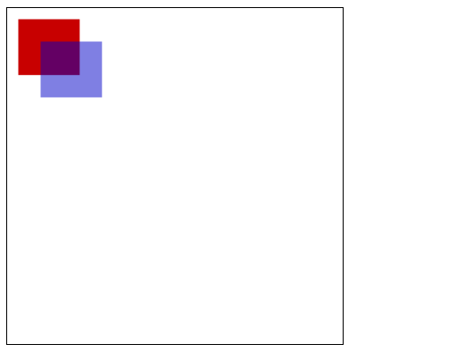

title: Canvas基础
speaker: 刘固
port: 8088
plugins:
    - echarts

<slide class="bg-white aligncenter">

# Canvas基础 {.text-landing.text-shadow}

By 刘固 {.text-intro}

## 目录

- 一、canvas简介
- 二、Canvas基本使用
- 三、绘制形状
- 四、绘制路径(path)
- 五、添加样式和颜色
- 六、绘制文本
- 七、绘制图片
- 八、状态的保存和恢复
- 九、变形
- 十一、裁剪路径
- 十二、动画


<slide class="bg-white alignleft">

## 一、canvas简介

 
​ `<canvas>` 是 HTML5 新增的，一个可以使用脚本(通常为JavaScript)在其中绘制图像的 HTML 元素。它可以用来制作照片集或者制作简单(也不是那么简单)的动画，甚至可以进行实时视频处理和渲染。

​ 它最初由苹果内部使用自己MacOS X WebKit推出，供应用程序使用像仪表盘的构件和 Safari 浏览器使用。 后来，有人通过Gecko内核的浏览器 (尤其是Mozilla和Firefox)，Opera和Chrome和超文本网络应用技术工作组建议为下一代的网络技术使用该元素。

​ Canvas是由HTML代码配合高度和宽度属性而定义出的可绘制区域。JavaScript代码可以访问该区域，类似于其他通用的二维API，通过一套完整的绘图函数来动态生成图形。

​ Mozilla 程序从 Gecko 1.8 (Firefox 1.5)开始支持 `<canvas>`, Internet Explorer 从IE9开始`<canvas>` 。Chrome和Opera 9+ 也支持 `<canvas>`。


<slide class="bg-white alignleft">

## 二、Canvas基本使用

### 2.1 `<canvas>`元素
```html 
<canvas id="tutorial" width="300" height="300"></canvas>
```
 `<canvas>`看起来和``标签一样，只是 `<canvas>` 只有两个可选的属性 width、heigth 属性，而没有 src、alt 属性。

​ 如果不给`<canvas>`设置widht、height属性时，则默认 width为300、height为150,单位都是px。也可以使用css属性来设置宽高，但是如宽高属性和初始比例不一致，他会出现扭曲。所以，建议永远不要使用css属性来设置`<canvas>`的宽高。

 替换内容

​ 由于某些较老的浏览器（尤其是IE9之前的IE浏览器）或者浏览器不支持HTML元素`<canvas>`，在这些浏览器上你应该总是能展示替代内容。
​ 支持`<canvas>`的浏览器会只渲染`<canvas>`标签，而忽略其中的替代内容。不支持 `<canvas>` 的浏览器则 会直接渲染替代内容。
> 用文本替换：
```
<canvas>
    你的浏览器不支持canvas,请升级你的浏览器
</canvas>
```
> 用 `` 替换：
```
<canvas>
     
</canvas>
```

### 2.2 渲染上下文(Thre Rending Context)

`<canvas>`会创建一个固定大小的画布，会公开一个或多个 渲染上下文(画笔)，使用 渲染上下文来绘制和处理要展示的内容。

​ 我们重点研究 2D 渲染上下文。 其他的上下文我们暂不研究，比如， WebGL使用了基于OpenGL ES的3D上下文 (“experimental-webgl”) 。

```javascript
var canvas = document.getElementById('tutorial');
//获得 2d 上下文对象
var ctx = canvas.getContext('2d');
```

### 2.3 检测支持性
```javascript
var canvas = document.getElementById('tutorial');

if (canvas.getContext){
  var ctx = canvas.getContext('2d');
  // 绘制图形代码
} else {
  // 提示浏览器不支持
}

```

### 2.4 代码模板
```html
<html>
<head>
    <title>Canvas tutorial</title>
    <style type="text/css">
        canvas {
            border: 1px solid black;
        }
    </style>
</head>
<canvas id="tutorial" width="300" height="300"></canvas>
</body>
<script type="text/javascript">
    function draw(){
        var canvas = document.getElementById('tutorial');
        if(!canvas.getContext) return;
      	var ctx = canvas.getContext("2d");
      	//开始代码
        
    }
    draw();
</script>
</html>

```
### 2.5 一个简单的例子

:::div {.content-left}
> 绘制两个长方形。

```html
<html>
<head>
    <title>Canvas tutorial</title>
    <style type="text/css">
        canvas {
            border: 1px solid black;
        }
    </style>
</head>
<canvas id="tutorial" width="300" height="300"></canvas>
</body>
<script type="text/javascript">
    function draw(){
        var canvas = document.getElementById('tutorial');
        if(!canvas.getContext) return;
        var ctx = canvas.getContext("2d");
        ctx.fillStyle = "rgb(200,0,0)";
      	//绘制矩形
        ctx.fillRect (10, 10, 55, 50);

        ctx.fillStyle = "rgba(0, 0, 200, 0.5)";
        ctx.fillRect (30, 30, 55, 50);
    }
    draw();
</script>
</html>

```

:::

:::div {.content-right}



:::


<slide class="bg-white alignleft">

## 三、绘制形状

###  3.1 栅格 `(grid)` 和坐标空间

 如下图所示，`canvas` 元素默认被网格所覆盖。通常来说网格中的一个单元相当于`canvas` 元素中的一像素。栅格的起点为左上角（坐标为（0,0））。所有元素的位置都相对于原点来定位。所以图中蓝色方形左上角的坐标为距离左边（X轴）x像素，距离上边（Y轴）y像素（坐标为（x,y））。

​ 后面我们会涉及到坐标原点的平移、网格的旋转以及缩放等。


### 3.2 绘制矩形

 `<canvas>` 只支持一种原生的 图形绘制：矩形。所有其他图形都至少需要生成一种路径(path)。不过，我们拥有众多路径生成的方法让复杂图形的绘制成为了可能。

 > `canvas` 提供了三种方法绘制矩形：

 1. `fillRect(x, y, width, height)`
 绘制一个填充矩形
 
 2. `strokeRect(x, y, width, height)`
 绘制一个矩形的边框

 3. `clearRect(x, y, widh, height)`
 清除指定的矩形区域，然后这块区域会变的完全透明。

说明：

​ 这3个方法具有相同的参数。

​ `x`, `y`：指的是矩形的左上角的坐标。(相对于`canvas`的坐标原点)

​ `width`, `height`：指的是绘制的矩形的宽和高。

```javascript
function draw(){
    var canvas = document.getElementById('tutorial');
    if(!canvas.getContext) return;
    var ctx = canvas.getContext("2d");
    ctx.fillRect(10, 10, 100, 50);  //绘制矩形,填充的默认颜色为黑色
    ctx.strokeRect(10, 70, 100, 50);  //绘制矩形边框
    ctx.clearRect(15, 15, 50, 25); // 清除指定的矩形区域
    
}
draw();
```


<slide class="bg-white alignleft">

## 四、 绘制路径

​ 图形的基本元素是路径。
​ 路径是通过不同颜色和宽度的线段或曲线相连形成的不同形状的点的集合。
​ 一个路径，甚至一个子路径，都是闭合的。

> 使用路径绘制图形需要一些额外的步骤：


1. 创建路径起始点
2. 调用绘制方法去绘制出路径
3. 把路径封闭
4. 一旦路径生成，通过描边或填充路径区域来渲染图形。

> 下面是需要用到的方法：

1. beginPath()
新建一条路径，路径一旦创建成功，图形绘制命令被指向到路径上生成路径

2. moveTo(x, y)
把画笔移动到指定的坐标(x, y)。相当于设置路径的起始点坐标。

3. closePath()
闭合路径之后，图形绘制命令又重新指向到上下文中

4. stroke()
通过线条来绘制图形轮廓

5. fill()
通过填充路径的内容区域生成实心的图形

### 4.1 绘制线段

```javascript
function draw(){
    var canvas = document.getElementById('tutorial');
    if (!canvas.getContext) return;
    var ctx = canvas.getContext("2d");
    ctx.beginPath(); //新建一条path
    ctx.moveTo(50, 50); //把画笔移动到指定的坐标
    ctx.lineTo(200, 50);  //绘制一条从当前位置到指定坐标(200, 50)的直线.
    //闭合路径。会拉一条从当前点到path起始点的直线。如果当前点与起始点重合，则什么都不做
    ctx.closePath();
    ctx.stroke(); //绘制路径。
}
draw();
```


