title: HTML5 Canvas 应用
speaker: 刘固
port: 8088
plugins:

<slide class="bg-gradient-r aligncenter">

#  HTML5 Canvas 应用 {.text-landing.text-shadow}

By 刘固 {.text-intro}

## 目录

- 一、canvas简介
- 二、Canvas基本使用
- 三、绘制形状
- 四、绘制路径(path)
- 五、添加样式和颜色
- 六、绘制文本
- 七、绘制图片
- 八、状态的保存和恢复
- 九、变形
- 十一、裁剪路径
- 十二、动画
- 十三、Canvas的应用以及组件库


<slide class="bg-gradient-r alignleft">

## 一、canvas简介

 
​ `<canvas>` 是 HTML5 新增的，一个可以使用脚本(通常为JavaScript)在其中绘制图像的 HTML 元素。它可以用来制作照片集或者制作简单(也不是那么简单)的动画，甚至可以进行实时视频处理和渲染。

​ 它最初由苹果内部使用自己MacOS X WebKit推出，供应用程序使用像仪表盘的构件和 Safari 浏览器使用。 后来，有人通过Gecko内核的浏览器 (尤其是Mozilla和Firefox)，Opera和Chrome和超文本网络应用技术工作组建议为下一代的网络技术使用该元素。

​ Canvas是由HTML代码配合高度和宽度属性而定义出的可绘制区域。JavaScript代码可以访问该区域，类似于其他通用的二维API，通过一套完整的绘图函数来动态生成图形。

​ Mozilla 程序从 Gecko 1.8 (Firefox 1.5)开始支持 `<canvas>`, Internet Explorer 从IE9开始`<canvas>` 。Chrome和Opera 9+ 也支持 `<canvas>`。


<slide class="bg-white alignleft">

## 二、Canvas基本使用

### 2.1 `<canvas>`元素
```html 
<canvas id="tutorial" width="300" height="300"></canvas>
```
 `<canvas>`看起来和``标签一样，只是 `<canvas>` 只有两个可选的属性 width、heigth 属性，而没有 src、alt 属性。

​ 如果不给`<canvas>`设置widht、height属性时，则默认 width为300、height为150,单位都是px。也可以使用css属性来设置宽高，但是如宽高属性和初始比例不一致，他会出现扭曲。所以，建议永远不要使用css属性来设置`<canvas>`的宽高。

 > 替换内容

​ 由于某些较老的浏览器（尤其是IE9之前的IE浏览器）或者浏览器不支持HTML元素`<canvas>`，在这些浏览器上你应该总是能展示替代内容。
​ 支持`<canvas>`的浏览器会只渲染`<canvas>`标签，而忽略其中的替代内容。不支持 `<canvas>` 的浏览器则 会直接渲染替代内容。
> 用文本替换：
```
<canvas>
    你的浏览器不支持canvas,请升级你的浏览器
</canvas>
```
> 用 `` 替换：
```
<canvas>
     
</canvas>
```

<slide class="bg-white alignleft">

### 2.2 渲染上下文(Thre Rending Context)

`<canvas>`会创建一个固定大小的画布，会公开一个或多个 渲染上下文(画笔)，使用 渲染上下文来绘制和处理要展示的内容。

​ 我们重点研究 2D 渲染上下文。 其他的上下文我们暂不研究，比如， WebGL使用了基于OpenGL ES的3D上下文 (“experimental-webgl”) 。

```javascript
var canvas = document.getElementById('tutorial');
//获得 2d 上下文对象
var ctx = canvas.getContext('2d');
```

### 2.3 检测支持性
```javascript
var canvas = document.getElementById('tutorial');

if (canvas.getContext){
  var ctx = canvas.getContext('2d');
  // 绘制图形代码
} else {
  // 提示浏览器不支持
}

```

<slide class="bg-white alignleft">

### 2.4 代码模板
```html
<html>
<head>
    <title>Canvas tutorial</title>
    <style type="text/css">
        canvas {
            border: 1px solid black;
        }
    </style>
</head>
<canvas id="tutorial" width="300" height="300"></canvas>
</body>
<script type="text/javascript">
    function draw(){
        var canvas = document.getElementById('tutorial');
        if(!canvas.getContext) return;
      	var ctx = canvas.getContext("2d");
      	//开始代码
        
    }
    draw();
</script>
</html>

```
### 2.5 一个简单的例子

:::div {.content-left}
> 绘制两个长方形。

```html
<html>
<head>
    <title>Canvas tutorial</title>
    <style type="text/css">
        canvas {
            border: 1px solid black;
        }
    </style>
</head>
<canvas id="tutorial" width="300" height="300"></canvas>
</body>
<script type="text/javascript">
    function draw(){
        var canvas = document.getElementById('tutorial');
        if(!canvas.getContext) return;
        var ctx = canvas.getContext("2d");
        ctx.fillStyle = "rgb(200,0,0)";
      	//绘制矩形
        ctx.fillRect (10, 10, 55, 50);

        ctx.fillStyle = "rgba(0, 0, 200, 0.5)";
        ctx.fillRect (30, 30, 55, 50);
    }
    draw();
</script>
</html>

```

:::

:::div {.content-right}

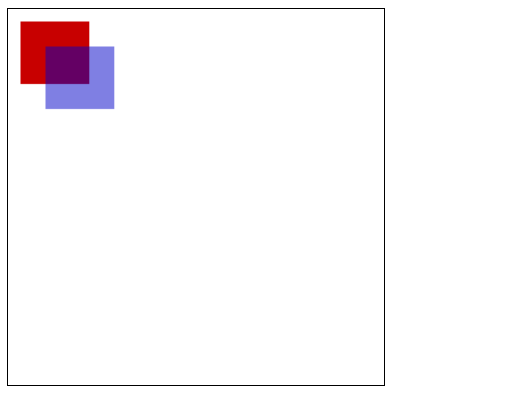

:::


<slide class="bg-white alignleft">

## 三、绘制形状

###  3.1 栅格 `(grid)` 和坐标空间

 如下图所示，`canvas` 元素默认被网格所覆盖。通常来说网格中的一个单元相当于`canvas` 元素中的一像素。栅格的起点为左上角（坐标为（0,0））。所有元素的位置都相对于原点来定位。所以图中蓝色方形左上角的坐标为距离左边（X轴）x像素，距离上边（Y轴）y像素（坐标为（x,y））。

​ 后面我们会涉及到坐标原点的平移、网格的旋转以及缩放等。


### 3.2 绘制矩形

 `<canvas>` 只支持一种原生的 图形绘制：矩形。所有其他图形都至少需要生成一种路径(path)。不过，我们拥有众多路径生成的方法让复杂图形的绘制成为了可能。

 > `canvas` 提供了三种方法绘制矩形：

 1. `fillRect(x, y, width, height)`
 绘制一个填充矩形
 
 2. `strokeRect(x, y, width, height)`
 绘制一个矩形的边框

 3. `clearRect(x, y, widh, height)`
 清除指定的矩形区域，然后这块区域会变的完全透明。

说明：

​ 这3个方法具有相同的参数。

​ `x`, `y`：指的是矩形的左上角的坐标。(相对于`canvas`的坐标原点)

​ `width`, `height`：指的是绘制的矩形的宽和高。

```javascript
function draw(){
    var canvas = document.getElementById('tutorial');
    if(!canvas.getContext) return;
    var ctx = canvas.getContext("2d");
    ctx.fillRect(10, 10, 100, 50);  //绘制矩形,填充的默认颜色为黑色
    ctx.strokeRect(10, 70, 100, 50);  //绘制矩形边框
    ctx.clearRect(15, 15, 50, 25); // 清除指定的矩形区域
    
}
draw();
```
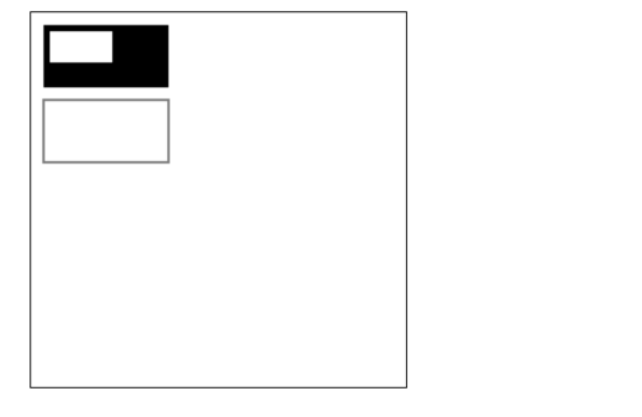

<slide class="bg-white alignleft">

## 四、 绘制路径

​ 图形的基本元素是路径。
​ 路径是通过不同颜色和宽度的线段或曲线相连形成的不同形状的点的集合。
​ 一个路径，甚至一个子路径，都是闭合的。

> 使用路径绘制图形需要一些额外的步骤:
1. 创建路径起始点
2. 调用绘制方法去绘制出路径
3. 把路径封闭
4. 一旦路径生成，通过描边或填充路径区域来渲染图形。

> 下面是需要用到的方法：

1. beginPath()
新建一条路径，路径一旦创建成功，图形绘制命令被指向到路径上生成路径

2. moveTo(x, y)
把画笔移动到指定的坐标(x, y)。相当于设置路径的起始点坐标。

3. closePath()
闭合路径之后，图形绘制命令又重新指向到上下文中

4. stroke()
通过线条来绘制图形轮廓

5. fill()
通过填充路径的内容区域生成实心的图形

### 4.1 绘制线段

```javascript
function draw(){
    var canvas = document.getElementById('tutorial');
    if (!canvas.getContext) return;
    var ctx = canvas.getContext("2d");
    ctx.beginPath(); //新建一条path
    ctx.moveTo(50, 50); //把画笔移动到指定的坐标
    ctx.lineTo(200, 50);  //绘制一条从当前位置到指定坐标(200, 50)的直线.
    //闭合路径。会拉一条从当前点到path起始点的直线。如果当前点与起始点重合，则什么都不做
    ctx.closePath();
    ctx.stroke(); //绘制路径。
}
draw();
```

<slide class="bg-white alignleft">

### 4.2 绘制三角形边框
```javascript
function draw(){
    var canvas = document.getElementById('tutorial');
    if (!canvas.getContext) return;
    var ctx = canvas.getContext("2d");
    ctx.beginPath();
    ctx.moveTo(50, 50);
    ctx.lineTo(200, 50);
    ctx.lineTo(200, 200);
  	ctx.closePath(); //虽然我们只绘制了两条线段，但是closePath会closePath，仍然是一个3角形
    ctx.stroke(); //描边。stroke不会自动closePath()
}
draw();
```

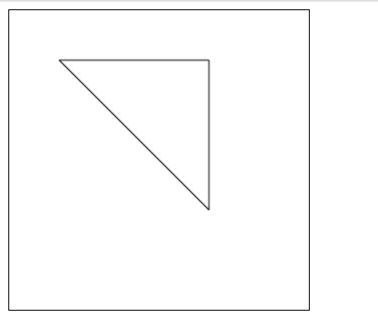

### 4.3 绘制填充三角形

```javascript
function draw(){
    var canvas = document.getElementById('tutorial');
    if (!canvas.getContext) return;
    var ctx = canvas.getContext("2d");
    ctx.beginPath();
    ctx.moveTo(50, 50);
    ctx.lineTo(200, 50);
    ctx.lineTo(200, 200);
   
    ctx.fill(); //填充闭合区域。如果path没有闭合，则fill()会自动闭合路径。
}
draw();
```
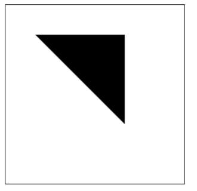

## 4.4 绘制圆弧

`arc(x, y, r, startAngle, endAngle, anticlockwise)`

以(x, y)为圆心，以r为半径，从 startAngle弧度开始到endAngle弧度结束。anticlosewise是布尔值，true表示逆时针，false表示顺时针。(默认是顺时针)

注意：
1. 这里的度数都是弧度。
`radians=(Math.PI/180)*degrees   //角度转换成弧度`

案例：
```javascript
function draw(){
    var canvas = document.getElementById('tutorial');
    if (!canvas.getContext) return;
    var ctx = canvas.getContext("2d");
    ctx.beginPath();
    ctx.arc(50, 50, 40, 0, Math.PI / 2, false);
    ctx.stroke();

    ctx.beginPath();
    ctx.arc(150, 50, 40, 0, -Math.PI / 2, true);
    ctx.closePath();
    ctx.stroke();

    ctx.beginPath();
    ctx.arc(50, 150, 40, -Math.PI / 2, Math.PI / 2, false);
    ctx.fill();

    ctx.beginPath();
    ctx.arc(150, 150, 40, 0, Math.PI, false);
    ctx.fill();

}
draw();

```

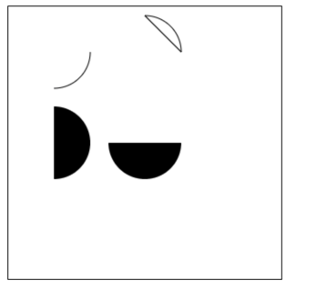

<slide class="bg-white alignleft">

## 五、添加样式和颜色

​ 在前面的绘制矩形章节中，只用到了默认的线条和颜色。

​ 如果想要给图形上色，有两个重要的属性可以做到。

1. `fillStyle = color`

设置图形的填充颜色

2. `strokeStyle = color`

设置图形轮廓的颜色

> 备注：
1. `color` 可以是表示 `css` 颜色值的字符串、渐变对象或者图案对象。
2. 默认情况下，线条和填充颜色都是黑色。
3. 一旦您设置了 `strokeStyle` 或者 `fillStyle` 的值，那么这个新值就会成为新绘制的图形的默认值。如果你要给每个图形上不同的颜色，你需要重新设置 `fillStyle` 或 `strokeStyle` 的值

### 5.1 fillStyle 给图形填充颜色
```javascript
function draw(){
  var canvas = document.getElementById('tutorial');
  if (!canvas.getContext) return;
  var ctx = canvas.getContext("2d");
  for (var i = 0; i < 6; i++){
    for (var j = 0; j < 6; j++){
      ctx.fillStyle = 'rgb(' + Math.floor(255 - 42.5 * i) + ',' +
        Math.floor(255 - 42.5 * j) + ',0)';
      ctx.fillRect(j * 50, i * 50, 50, 50);
    }
  }
}
draw();

```

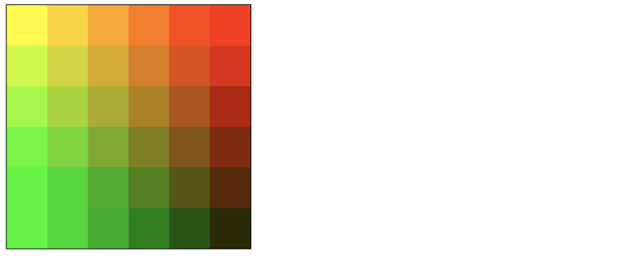

<slide class="bg-white alignleft">

### 5.2 strokeStyle 
```javascript
function draw(){
    var canvas = document.getElementById('tutorial');
    if (!canvas.getContext) return;
    var ctx = canvas.getContext("2d");
    for (var i = 0; i < 6; i++){
        for (var j = 0; j < 6; j++){
            ctx.strokeStyle = `rgb(${randomInt(0, 255)},${randomInt(0, 255)},${randomInt(0, 255)})`;
            ctx.strokeRect(j * 50, i * 50, 40, 40);
        }
    }
}
draw();
/**
 返回随机的 [from, to] 之间的整数(包括from，也包括to)
 */
function randomInt(from, to){
    return parseInt(Math.random() * (to - from + 1) + from);
}

```
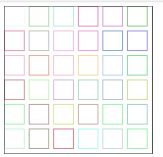

<slide class="bg-white alignleft">

### 5.3 Transparency(透明度)
globalAlpha = transparencyValue

​ 这个属性影响到 canvas 里所有图形的透明度，有效的值范围是 0.0 （完全透明）到 1.0（完全不透明），默认是 1.0。

​ globalAlpha 属性在需要绘制大量拥有相同透明度的图形时候相当高效。不过，我认为使用rgba()设置透明度更加好一些。


<slide class="bg-white alignleft">

### 5.4 line style

#### lineWidth = value

线宽。只能是正值。默认是1.0。

起始点和终点的连线为中心，上下各占线宽的一半
```javascript
ctx.beginPath();
ctx.moveTo(10, 10);
ctx.lineTo(100, 10);
ctx.lineWidth = 10;
ctx.stroke();

ctx.beginPath();
ctx.moveTo(110, 10);
ctx.lineTo(160, 10)
ctx.lineWidth = 20;
ctx.stroke()

```
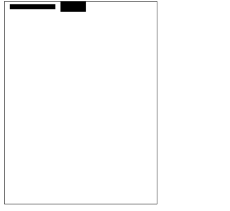

<slide class="bg-white alignleft">

#### 5.5 lineCap = type

线条末端样式。

1. butt：线段末端以方形结束

2. round：线段末端以圆形结束

3. square：线段末端以方形结束，但是增加了一个宽度和线段相同，高度是线段厚度一半的矩形区域。

```javascript
var lineCaps = ["butt", "round", "square"];

for (var i = 0; i < 3; i++){
    ctx.beginPath();
    ctx.moveTo(20 + 30 * i, 30);
    ctx.lineTo(20 + 30 * i, 100);
    ctx.lineWidth = 20;
    ctx.lineCap = lineCaps[i];
    ctx.stroke();
}

ctx.beginPath();
ctx.moveTo(0, 30);
ctx.lineTo(300, 30);

ctx.moveTo(0, 100);
ctx.lineTo(300, 100)

ctx.strokeStyle = "red";
ctx.lineWidth = 1;
ctx.stroke();

```
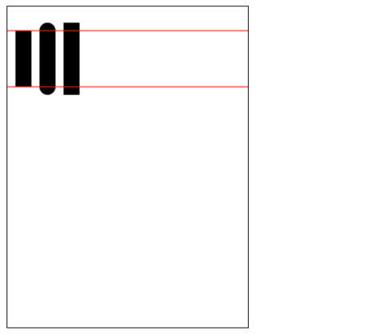

<slide class="bg-white alignleft">

#### 5.6 lineJoin = type

同一个path内，设定线条与线条间接合处的样式。

共有3个值round, bevel 和 miter：

1. round

通过填充一个额外的，圆心在相连部分末端的扇形，绘制拐角的形状。 圆角的半径是线段的宽度。

2. bevel

在相连部分的末端填充一个额外的以三角形为底的区域， 每个部分都有各自独立的矩形拐角。

3. miter(默认)

```javascript
function draw(){
    var canvas = document.getElementById('tutorial');
    if (!canvas.getContext) return;
    var ctx = canvas.getContext("2d");

    var lineJoin = ['round', 'bevel', 'miter'];
    ctx.lineWidth = 20;

    for (var i = 0; i < lineJoin.length; i++){
        ctx.lineJoin = lineJoin[i];
        ctx.beginPath();
        ctx.moveTo(50, 50 + i * 50);
        ctx.lineTo(100, 100 + i * 50);
        ctx.lineTo(150, 50 + i * 50);
        ctx.lineTo(200, 100 + i * 50);
        ctx.lineTo(250, 50 + i * 50);
        ctx.stroke();
    }

}
draw();

```
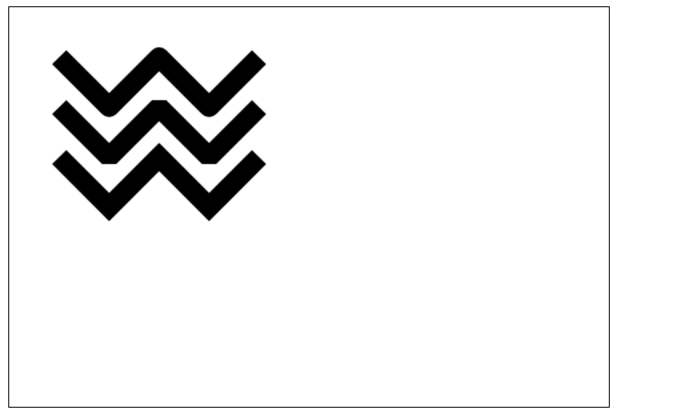

#### 5.7 虚线

用 `setLineDash` 方法和 `lineDashOffset` 属性来制定虚线样式. `setLineDash` 方法接受一个数组，来指定线段与间隙的交替；`lineDashOffset` 属性设置起始偏移量。

```javascript
function draw(){
    var canvas = document.getElementById('tutorial');
    if (!canvas.getContext) return;
    var ctx = canvas.getContext("2d");
    
    ctx.setLineDash([20, 5]);  // [实线长度, 间隙长度]
    ctx.lineDashOffset = -0;
    ctx.strokeRect(50, 50, 210, 210);
}
draw();

```


<slide class="bg-white alignleft">

## 六、绘制文本

绘制文本的两个方法

1. fillText(text, x, y [, maxWidth]) 在指定的 (x,y) 位置填充指定的文本，绘制的最大宽度是可选的。

2. strokeText(text, x, y [, maxWidth]) 在指定的 (x,y) 位置绘制文本边框，绘制的最大宽度是可选的。

```javascript
var ctx;
function draw(){
    var canvas = document.getElementById('tutorial');
    if (!canvas.getContext) return;
    ctx = canvas.getContext("2d");
    ctx.font = "100px sans-serif"
    ctx.fillText("天若有情", 10, 100);
    ctx.strokeText("天若有情", 10, 200)
}
draw();
```

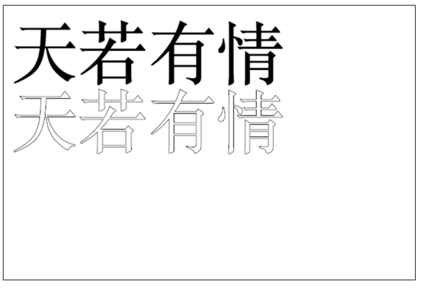

给文本添加样式

1. font = value 当前我们用来绘制文本的样式。这个字符串使用和 CSS font 属性相同的语法。 默认的字体是 10px sans-serif。

2. textAlign = value 文本对齐选项。 可选的值包括：start, end, left, right or center。 默认值是 start。

3. textBaseline = value 基线对齐选项，可选的值包括：top, hanging, middle, alphabetic, ideographic, bottom。默认值是 alphabetic。。

4. direction = value 文本方向。可能的值包括：ltr, rtl, inherit。默认值是 inherit。


<slide class="bg-white alignleft">

## 七、绘制图片

### 7.1 由零开始创建图片

```javascript
var img = new Image();   // 创建一个元素
img.src = 'myImage.png'; // 设置图片源地址

```
脚本执行后图片开始装载。

绘制img
```javascript
// 参数 1：要绘制的 img  
// 参数 2、3：绘制的 img 在 canvas 中的坐标
ctx.drawImage(img,0,0); 

```

**注意：** 考虑到图片是从网络加载，如果 drawImage 的时候图片还没有完全加载完成，则什么都不做，个别浏览器会抛异常。所以我们应该保证在 img 绘制完成之后再 drawImage。
```javascript
var img = new Image();   // 创建img元素
img.onload = function(){
    ctx.drawImage(img, 0, 0)
}
img.src = 'myImage.png'; // 设置图片源地址
```

### 绘制 img 标签元素中的图片
```html
<br>
<canvas id="tutorial" width="600" height="400"></canvas>
```
``` javascript
function draw(){
    var canvas = document.getElementById('tutorial');
    if (!canvas.getContext) return;
    var ctx = canvas.getContext("2d");
    var img = document.querySelector("img");
    ctx.drawImage(img, 0, 0);
}

document.querySelector("img").onclick = function (){
    draw();
}
```
第一张图片就是页面中的  标签：

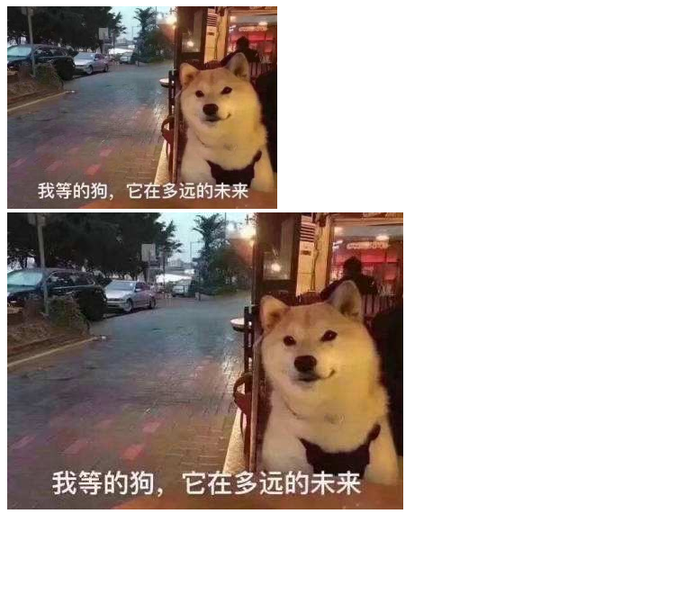


### 7.3 缩放图片
drawImage() 也可以再添加两个参数：

`drawImage(image, x, y, width, height)`

​这个方法多了 2 个参数：width 和 height，这两个参数用来控制 当像 canvas 画入时应该缩放的大小。


`ctx.drawImage(img, 0, 0, 400, 200)`


### 7.4 切片(slice)

`drawImage(image, sx, sy, sWidth, sHeight, dx, dy, dWidth, dHeight)`

第一个参数和其它的是相同的，都是一个图像或者另一个 canvas 的引用。

其他 8 个参数：

前 4 个是定义图像源的切片位置和大小，后 4 个则是定义切片的目标显示位置和大小。


<slide class="bg-white alignleft">

## 八、状态的保存和恢复

Saving and restoring state 是绘制复杂图形时必不可少的操作。

save() 和 restore()

save 和 restore 方法是用来保存和恢复 canvas 状态的，都没有参数。

​Canvas 的状态就是当前画面应用的所有样式和变形的一个快照。

1. 关于 save() ：Canvas状态存储在栈中，每当save()方法被调用后，当前的状态就被推送到栈中保存。

一个绘画状态包括：
 - 当前应用的变形（即移动，旋转和缩放）
 - strokeStyle, fillStyle, globalAlpha, lineWidth, lineCap, lineJoin, miterLimit, shadowOffsetX, shadowOffsetY, shadowBlur, shadowColor, globalCompositeOperation 的值
 -  当前的裁切路径（clipping path）

​ **可以调用任意多次 save方法(类似数组的 push())。**

2. 关于restore()：每一次调用 restore 方法，上一个保存的状态就从栈中弹出，所有设定都恢复(类似数组的 pop())。


```javascript

var ctx;
function draw(){
    var canvas = document.getElementById('tutorial');
    if (!canvas.getContext) return;
    var ctx = canvas.getContext("2d");
 
    ctx.fillRect(0, 0, 150, 150);   // 使用默认设置绘制一个矩形
    ctx.save();                  // 保存默认状态
 
    ctx.fillStyle = 'red'       // 在原有配置基础上对颜色做改变
    ctx.fillRect(15, 15, 120, 120); // 使用新的设置绘制一个矩形
 
    ctx.save();                  // 保存当前状态
    ctx.fillStyle = '#FFF'       // 再次改变颜色配置
    ctx.fillRect(30, 30, 90, 90);   // 使用新的配置绘制一个矩形
 
    ctx.restore();               // 重新加载之前的颜色状态
    ctx.fillRect(45, 45, 60, 60);   // 使用上一次的配置绘制一个矩形
 
    ctx.restore();               // 加载默认颜色配置
    ctx.fillRect(60, 60, 30, 30);   // 使用加载的配置绘制一个矩形
}
draw();
```


<slide class="bg-white alignleft">

## 九、变形

### 9.1 translate
`translate(x, y)`

用来移动 canvas 的原点到指定的位置

​translate 方法接受两个参数。x 是左右偏移量，y 是上下偏移量，如右图所示。

在做变形之前先保存状态是一个良好的习惯。大多数情况下，调用 restore 方法比手动恢复原先的状态要简单得多。又如果你是在一个循环中做位移但没有保存和恢复 canvas 的状态，很可能到最后会发现怎么有些东西不见了，那是因为它很可能已经超出 canvas 范围以外了。

​ 注意：translate 移动的是 canvas 的坐标原点(坐标变换)。

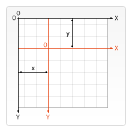

```javascript

var ctx;
function draw(){
    var canvas = document.getElementById('tutorial1');
    if (!canvas.getContext) return;
    var ctx = canvas.getContext("2d");
    ctx.save(); //保存坐原点平移之前的状态
    ctx.translate(100, 100);
    ctx.strokeRect(0, 0, 100, 100)
    ctx.restore(); //恢复到最初状态
    ctx.translate(220, 220);
    ctx.fillRect(0, 0, 100, 100)
}
draw();

```
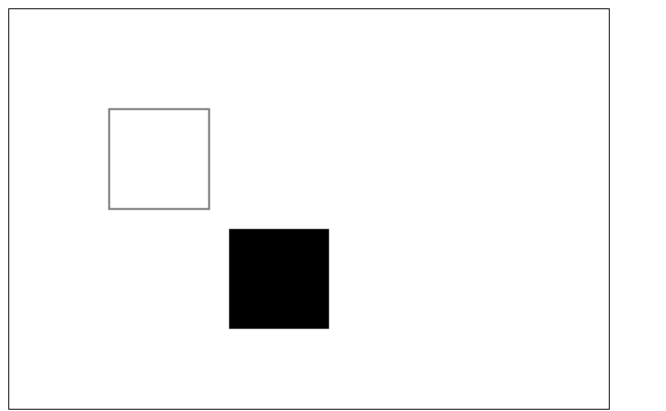

### 9.2 rotate

`rotate(angle)`

旋转坐标轴

这个方法只接受一个参数：旋转的角度(angle)，它是顺时针方向的，以弧度为单位的值。

​ 旋转的中心是坐标原点。


```javascript
var ctx;
function draw(){
  var canvas = document.getElementById('tutorial1');
  if (!canvas.getContext) return;
  var ctx = canvas.getContext("2d");
 
  ctx.fillStyle = "red";
  ctx.save();
 
  ctx.translate(100, 100);
  ctx.rotate(Math.PI / 180 * 45);
  ctx.fillStyle = "blue";
  ctx.fillRect(0, 0, 100, 100);
  ctx.restore();
 
  ctx.save();
  ctx.translate(0, 0);
  ctx.fillRect(0, 0, 50, 50)
  ctx.restore();
}
draw();
```
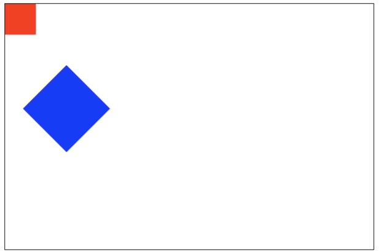

### 9.3 scale (缩放)

`scala(x,y)`

我们用它来增减图形在 canvas 中的像素数目，对形状，位图进行缩小或者放大。

scale方法接受两个参数。x,y 分别是横轴和纵轴的缩放因子，它们都必须是正值。值比 1.0 小表示缩 小，比 1.0 大则表示放大，值为 1.0 时什么效果都没有。

​ 默认情况下，canvas 的 1 单位就是 1 个像素。举例说，如果我们设置缩放因子是 0.5，1 个单位就变成对应 0.5 个像素，这样绘制出来的形状就会是原先的一半。同理，设置为 2.0 时，1 个单位就对应变成了 2 像素，绘制的结果就是图形放大了 2 倍。


### 9.4 transform (变形矩阵)

`transform(a, b, c, d, e, f)`

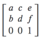

1. a: Horizontal scaling.(水平伸缩)
2. b: Horizontal skewing.(水平倾斜)
3. c: Vertical skewing.(垂直偏移)
4. d: Vertical scaling. (垂直倾斜
5. e: Horizontal moving. (水平移动)
6. f: Vertical moving. （垂直移动）

```javascript
var ctx;
function draw(){
    var canvas = document.getElementById('tutorial1');
    if (!canvas.getContext) return;
    var ctx = canvas.getContext("2d");
    ctx.transform(1, 1, 0, 1, 0, 0);
    ctx.fillRect(0, 0, 100, 100);
}
draw();
```
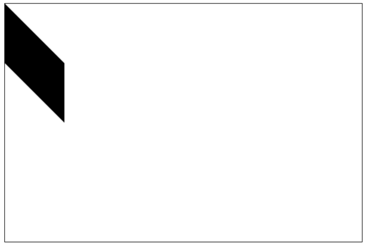


<slide class="bg-white alignleft">

## 十、合成

在前面的所有例子中、，我们总是将一个图形画在另一个之上，对于其他更多的情况，仅仅这样是远远不够的。比如，对合成的图形来说，绘制顺序会有限制。不过，我们可以利用 globalCompositeOperation 属性来改变这种状况。

`globalCompositeOperation = type`

```javascript
var ctx;
function draw(){
    var canvas = document.getElementById('tutorial1');
    if (!canvas.getContext) return;
    var ctx = canvas.getContext("2d");
 
    ctx.fillStyle = "blue";
    ctx.fillRect(0, 0, 200, 200);
 
    ctx.globalCompositeOperation = "source-over"; //全局合成操作
    ctx.fillStyle = "red";
    ctx.fillRect(100, 100, 200, 200);
}
draw();

```

**注：**下面的展示中，蓝色是原有的，红色是新的。

type 是下面 13 种字符串值之一：

1. 这是默认设置，新图像会覆盖在原有图像。
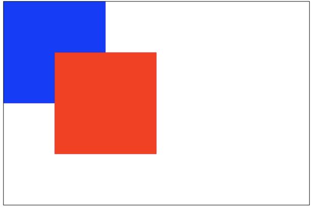

2. source-in

仅仅会出现新图像与原来图像重叠的部分，其他区域都变成透明的。(包括其他的老图像区域也会透明)


3. source-out

仅仅显示新图像与老图像没有重叠的部分，其余部分全部透明。(老图像也不显示)

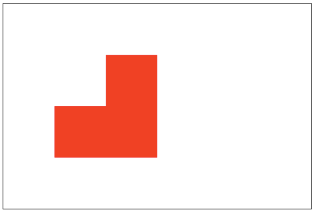

4. source-atop
新图像仅仅显示与老图像重叠区域。老图像仍然可以显示。

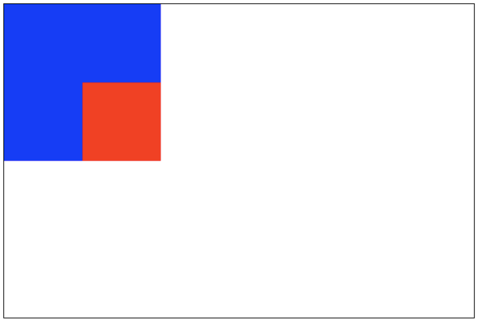

5. destination-over

新图像会在老图像的下面。

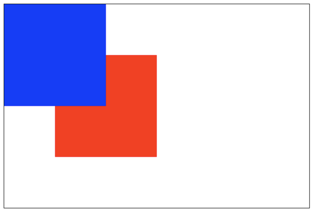

6. destination-in
仅仅新老图像重叠部分的老图像被显示，其他区域全部透明。

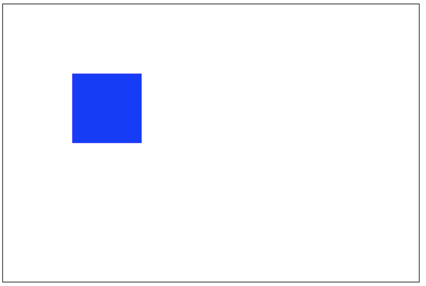

7. destination-out

仅仅老图像与新图像没有重叠的部分。 注意显示的是老图像的部分区域。

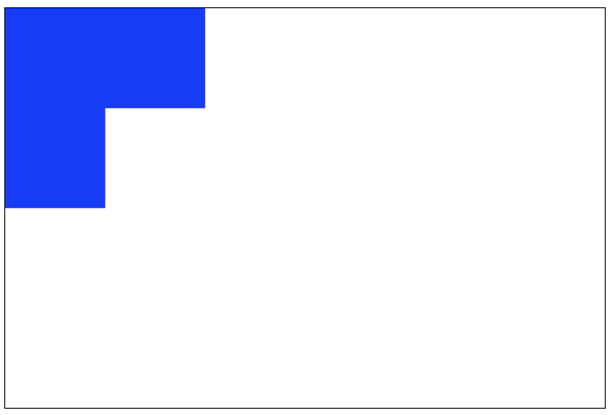

8. destination-atop
老图像仅仅仅仅显示重叠部分，新图像会显示在老图像的下面。

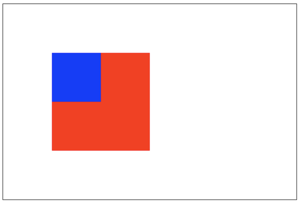


9. lighter
新老图像都显示，但是重叠区域的颜色做加处理。

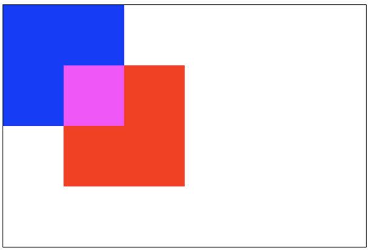

10. darken
保留重叠部分最黑的像素。(每个颜色位进行比较，得到最小的)

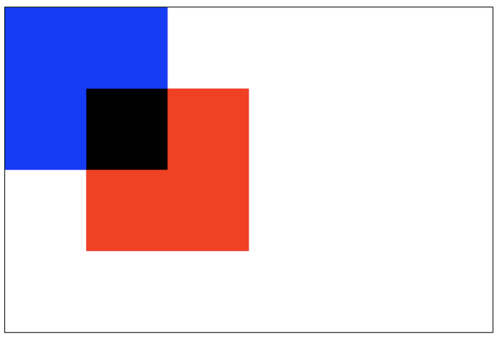

11. lighten
保证重叠部分最量的像素。(每个颜色位进行比较，得到最大的)

```
blue: #0000ff
red: #ff0000
```

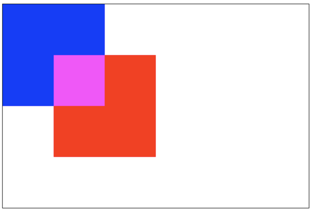

12. xor

重叠部分会变成透明。

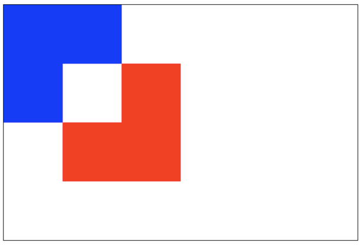

13. copy

只有新图像会被保留，其余的全部被清除(边透明)。

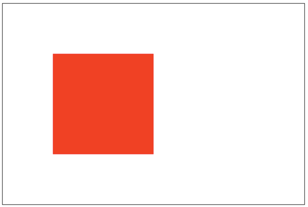


<slide class="bg-white alignleft">

## 十一、裁剪路径

`clip()`

把已经创建的路径转换成裁剪路径。

​
裁剪路径的作用是遮罩。只显示裁剪路径内的区域，裁剪路径外的区域会被隐藏。（在canvas画布上，设置可绘制的区域）

- 默认情况下，canvas 有一个与它自身一样大的裁切路径（也就是没有裁切效果）.
- 裁切路径和普通的 canvas 图形差不多，不同的是它的作用是遮罩，用来隐藏不需要的部分
- 最重要的区别是裁切路径不会在 canvas 上绘制东西，而且它永远不受新图形的影响

​
**注意**：clip() 只能遮罩在这个方法调用之后绘制的图像，如果是 clip() 方法调用之前绘制的图像，则无法实现遮罩。
```javascript

var ctx;
function draw(){
    var canvas = document.getElementById('demo');
    if (!canvas.getContext) return;
    var ctx = canvas.getContext("2d");
 
    ctx.beginPath();

    ctx.arc(20,20, 100, 0, Math.PI*2);
    ctx.clip(); 
    // ctx.stroke();

    // 一个正方形,裁剪后
    ctx.fillStyle = "pink";
    ctx.fillRect(20, 20, 100,100);
}
draw();

```
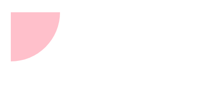

<slide class="bg-white alignleft">

## 十二、动画

### 动画的基本步骤

1. **清空** canvas 再绘制每一帧动画之前，需要清空所有。清空所有最简单的做法就是 clearRect() 方法。

2. **保存** canvas 状态 如果在绘制的过程中会更改 canvas 的状态(颜色、移动了坐标原点等),又在绘制每一帧时都是原始状态的话，则最好保存下 canvas 的状态

3. **绘制动画图形**这一步才是真正的绘制动画帧

4. **恢复** canvas 状态如果你前面保存了 canvas 状态，则应该在绘制完成一帧之后恢复 canvas 状态。

### 控制动画

我们可用通过 canvas 的方法或者自定义的方法把图像会知道到 canvas 上。正常情况，我们能看到绘制的结果是在脚本执行结束之后。例如，我们不可能在一个 for 循环内部完成动画。

也就是，为了执行动画，我们需要一些可以定时执行重绘的方法。

一般用到下面三个方法：

1. setInterval()
2. setTimeout()
3. requestAnimationFrame()

通常我们使用 requestAnimationFrame ，它有三个优势：

**CPU节能**：使用setTimeout实现的动画，当页面被隐藏或最小化时，setTimeout 仍然在后台执行动画任务，由于此时页面处于不可见或不可用状态，刷新动画是没有意义的，完全是浪费CPU资源。而requestAnimationFrame则完全不同，当页面处理未激活的状态下，该页面的屏幕刷新任务也会被系统暂停，因此跟着系统步伐走的requestAnimationFrame也会停止渲染，当页面被激活时，动画就从上次停留的地方继续执行，有效节省了CPU开销。

**函数节流：**在高频率事件(resize,scroll等)中，为了防止在一个刷新间隔内发生多次函数执行，使用requestAnimationFrame可保证每个刷新间隔内，函数只被执行一次，这样既能保证流畅性，也能更好的节省函数执行的开销。

**优雅降级**：由于兼容性问题，需要降级对接口进行封装，优先使用高级特性，再根据浏览器不同情况进行回退，直到只能使用settimeout。参考[GitHub](https://github.com/darius/requestAnimationFrame）


<slide class="bg-white aligncenter">

### 案例1 ：太阳系

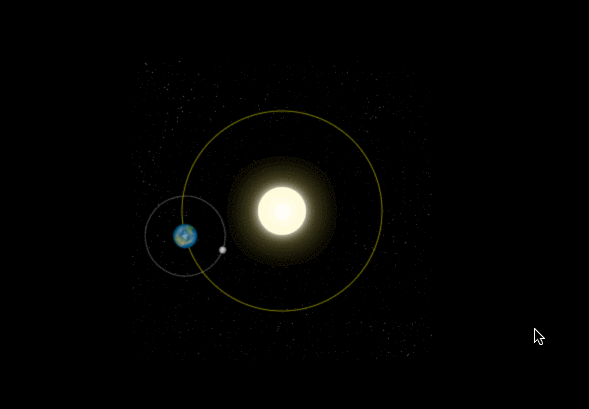

```javascript
let sun;
let earth;
let moon;
let ctx;
function init(){
    sun = new Image();
    earth = new Image();
    moon = new Image();
    sun.src = "sun.png";
    earth.src = "earth.png";
    moon.src = "moon.png";
 
    let canvas = document.querySelector("#solar");
    ctx = canvas.getContext("2d");
 
    sun.onload = function (){
        draw()
    }
 
}
init();
function draw(){
    ctx.clearRect(0, 0, 300, 300); //清空所有的内容
    /*绘制 太阳*/
    ctx.drawImage(sun, 0, 0, 300, 300);
 
    ctx.save();
    ctx.translate(150, 150);
 
    //绘制earth轨道
    ctx.beginPath();
    ctx.strokeStyle = "rgba(255,255,0,0.5)";
    ctx.arc(0, 0, 100, 0, 2 * Math.PI)
    ctx.stroke()
 
    let time = new Date();
    //绘制地球
    ctx.rotate(2 * Math.PI / 60 * time.getSeconds() + 2 * Math.PI / 60000 * time.getMilliseconds())
    ctx.translate(100, 0);
    ctx.drawImage(earth, -12, -12)
 
    //绘制月球轨道
    ctx.beginPath();
    ctx.strokeStyle = "rgba(255,255,255,.3)";
    ctx.arc(0, 0, 40, 0, 2 * Math.PI);
    ctx.stroke();
 
    //绘制月球
    ctx.rotate(2 * Math.PI / 6 * time.getSeconds() + 2 * Math.PI / 6000 * time.getMilliseconds());
    ctx.translate(40, 0);
    ctx.drawImage(moon, -3.5, -3.5);
    ctx.restore();
 
    requestAnimationFrame(draw);
}
```


<slide class="bg-white aligncenter">

### 案例2：模拟时钟


:::div {.content-left .width300}

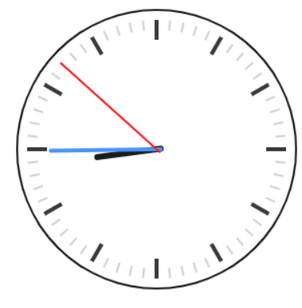{.content-left} 

:::

:::div{.content-right}
```html
<!DOCTYPE html>
<html lang="en">

<head>
    <meta charset="UTF-8">
    <meta name="viewport" content="width=device-width, initial-scale=1.0">
    <meta http-equiv="X-UA-Compatible" content="ie=edge">
    <title>时钟</title>
</head>

<body>

    <canvas id="clock" width="500" height="500"></canvas>


    <script>
        init();

        function init() {
            let canvas = document.querySelector("#clock");
            let ctx = canvas.getContext("2d");
            draw(ctx);
        }

        function draw(ctx) {
            requestAnimationFrame(function step() {
                drawDial(ctx); //绘制表盘
                drawAllHands(ctx); //绘制时分秒针
                requestAnimationFrame(step);
            });
        }
        /*绘制时分秒针*/
        function drawAllHands(ctx) {
            let time = new Date();

            let s = time.getSeconds();
            let m = time.getMinutes();
            let h = time.getHours();

            let pi = Math.PI;
            let secondAngle = pi / 180 * 6 * s; //计算出来s针的弧度
            let minuteAngle = pi / 180 * 6 * m + secondAngle / 60; //计算出来分针的弧度
            let hourAngle = pi / 180 * 30 * h + minuteAngle / 12; //计算出来时针的弧度

            drawHand(hourAngle, 60, 6, "black", ctx); //绘制时针
            drawHand(minuteAngle, 106, 4, "#38f", ctx); //绘制分针
            drawHand(secondAngle, 129, 2, "red", ctx); //绘制秒针
        }
        /*绘制时针、或分针、或秒针
         * 参数1：要绘制的针的角度
         * 参数2：要绘制的针的长度
         * 参数3：要绘制的针的宽度
         * 参数4：要绘制的针的颜色
         * 参数4：ctx
         * */
        function drawHand(angle, len, width, color, ctx) {
            ctx.save();
            ctx.translate(150, 150); //把坐标轴的远点平移到原来的中心
            ctx.rotate(-Math.PI / 2 + angle); //旋转坐标轴。 x轴就是针的角度
            ctx.beginPath();
            ctx.moveTo(-4, 0);
            ctx.lineTo(len, 0); // 沿着x轴绘制针
            ctx.lineWidth = width;
            ctx.strokeStyle = color;
            ctx.lineCap = "round";
            ctx.stroke();
            ctx.closePath();
            ctx.restore();
        }

        /*绘制表盘*/
        function drawDial(ctx) {
            let pi = Math.PI;

            ctx.clearRect(0, 0, 300, 300); //清除所有内容
            ctx.save();

            ctx.translate(150, 150); //一定坐标原点到原来的中心
            ctx.beginPath();
            ctx.arc(0, 0, 140, 0, 2 * pi); //绘制圆周
            ctx.lineWidth = 2;
            ctx.stroke();
            ctx.closePath();

            for (let i = 0; i < 60; i++) { //绘制刻度。
                ctx.save();
                ctx.rotate(-pi / 2 + i * pi / 30); //旋转坐标轴。坐标轴x的正方形从 向上开始算起
                ctx.beginPath();
                
                if(i % 5){
                    ctx.moveTo(120, 0);
                }else{
                    ctx.moveTo(110, 0);
                }
                ctx.lineTo(130, 0);

                ctx.lineWidth = i % 5 ? 2 : 4;
                ctx.strokeStyle = i % 5 ? "#ccc" : "#222";
                ctx.stroke();
                ctx.closePath();
                ctx.restore();
            }
            ctx.restore();
        }
    </script>
</body>

</html>
```
:::

<slide class="bg-white alignleft">

## 十三、Canvas的应用以及组件库

1. Echarts
ECharts是百度开源的纯 Javascript 图表库，目前开源可以与highcharts相匹敌的一个图表库.支持折线图（区域图）、柱状图（条状图）、散点图（气泡图）、K线图、饼图（环形图）、雷达图（填充雷达图）、和弦图、力导向布局图、地图、仪表盘、漏斗图、事件河流图等12类图表，同时提供标题，详情气泡、图例、值域、数据区域、时间轴、工具箱等7个可交互组件，支持多图表、组件的联动和混搭展现。

2. AntV  [ G2 G6 F2 L7 ]
AntV 是蚂蚁金服全新一代数据可视化解决方案，致力于提供一套简单
方便、专业可靠、无限可能的数据可视化最佳实践。
[AntV官网](https://antv.alipay.com/zh-cn/index.html#__products)

3. fabric.js
一个 Javascript Canvas库


> 注：目前实现图表功能 可以选择Canvas 或者 SVG , Echarts 和 G2 都封装好了，可以自定义配置使用 Canvas 渲染还是SVG 渲染 


Canvas与SVG 比较

Canvas
- 依赖分辨率
- 不支持事件处理器
- 弱的文本渲染能力
- 能够以 .png 或 .jpg 格式保存结果图像
- 最适合图像密集型的游戏和应用，其中的许多对象会被频繁重绘

SVG
- 不依赖分辨率
- 支持事件处理器
- 最适合带有大型渲染区域的应用程序（比如谷歌地图）
- 复杂度高会减慢渲染速度（任何过度使用 DOM 的应用都不快）
- 不适合游戏应用


<slide class="bg-white aligncenter">

## Thanks


